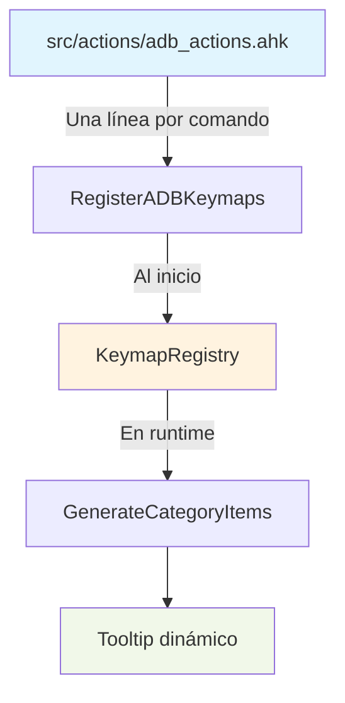

# Command Layer - Sistema Declarativo (Estilo lazy.nvim/which-key)

## 🎯 Resumen

El **Command Layer** es un sistema de paleta de comandos inspirado en Neovim's which-key, donde **cada comando se define en una sola línea** sin archivos de configuración externa. Todo el sistema se genera dinámicamente desde el código AHK en runtime.

**Navegación:**
- **Esc**: Salir completamente
- **Backspace**: Volver al menú anterior  
- **Timeout**: 10 segundos de inactividad

## 🚀 Acceso Rápido

**Activación:** `Hold CapsLock + Space → c`

```
<leader> → c (Commands)
         ↓
┌─────────────────────────────┐
│   COMMAND PALETTE           │
│                             │
│ s - System Commands         │
│ h - Hybrid Management       │
│ g - Git Commands            │
│ m - Monitoring Commands     │
│ n - Network Commands        │
│ f - Folder Access           │
│ o - Power Options           │
│ a - ADB Tools               │
│ v - VaultFlow               │
└─────────────────────────────┘
```

---

## 🏗️ Arquitectura del Sistema

### **Filosofía: Todo en Código, Nada en Configuración Externa**



**Flujo completo:**
```
1. INICIO → InitializeCommandSystem()
2. REGISTRO → RegisterKeymap("adb", "d", "List Devices", ADBListDevices, false, 1)
3. ALMACENAMIENTO → KeymapRegistry["adb"]["d"] = {...}
4. RUNTIME → GenerateCategoryItems("adb") → "d:List Devices|x:Disconnect..."
5. DISPLAY → Tooltip C# o nativo
```

---

## ✨ Cómo Agregar Nuevos Comandos

### **Método 1: Agregar a Categoría Existente** ⭐

**Ejemplo: Agregar "Windows Version" a System Commands**

1. **Abre:** `src/actions/system_actions.ahk`

2. **Agrega la función:**
```ahk
ShowWindowsVersion() {
    Run("cmd.exe /k ver")
    ShowCommandExecuted("System", "Windows Version")
}
```

3. **Registra el comando (UNA LÍNEA):**
```ahk
RegisterSystemKeymaps() {
    RegisterKeymap("system", "s", "System Info", ShowSystemInfo, false, 1)
    RegisterKeymap("system", "w", "Windows Version", ShowWindowsVersion, false, 10)  // ← NUEVA
}
```

4. **Reinicia:** `<leader> → c → h → R`

✅ **¡Listo!** El comando aparece automáticamente en el menú.

---

### **Método 2: Crear Nueva Categoría Completa**

**Ejemplo: Agregar "Docker Commands"**

<details>
<summary><b>📖 Ver guía completa (click para expandir)</b></summary>

#### **Paso 1: Crear archivo de acciones**

Crea: `src/actions/docker_actions.ahk`

```ahk
; ==============================
; Docker Actions - Sistema Declarativo Completo
; ==============================

; FUNCIONES DE ACCIÓN
DockerPS() {
    Run("cmd.exe /k docker ps")
    ShowCommandExecuted("Docker", "List Containers")
}

DockerStopAll() {
    Run("cmd.exe /k docker stop $(docker ps -q)")
    ShowCommandExecuted("Docker", "Stop All")
}

; REGISTRO DECLARATIVO
RegisterDockerKeymaps() {
    RegisterKeymap("docker", "p", "List Containers", DockerPS, false, 1)
    RegisterKeymap("docker", "s", "Stop All", DockerStopAll, true, 2)  // confirm
}
```

#### **Paso 2: Include en init.ahk**

```ahk
#Include src\actions\docker_actions.ahk
```

#### **Paso 3: Registrar en command_system_init.ahk**

```ahk
InitializeCommandSystem() {
    RegisterCategory("d", "docker", "Docker Commands", 10)
    RegisterDockerKeymaps()
}
```

#### **Paso 4: Integrar tooltip C# (opcional)**

En `src/ui/tooltip_csharp_integration.ahk`:

**A) Switch de navegación:**
```ahk
case "d": ShowDockerCommandsMenuCS()
```

**B) Función de menú:**
```ahk
ShowDockerCommandsMenuCS() {
    TooltipNavPush("CMD_d")
    items := GenerateCategoryItems("docker")
    if (items = "")
        items := "[No commands registered]"
    ShowCSharpOptionsMenu("DOCKER COMMANDS", items, "\\: Back|ESC: Exit")
}
```

**C) Case en TooltipShowById:**
```ahk
case "CMD_d": ShowDockerCommandsMenuCS()
```

</details>

---

## 📝 Referencia: `RegisterKeymap()`

```ahk
RegisterKeymap(category, key, description, actionFunc, needsConfirm, order)
```

### **Parámetros:**

| Parámetro | Tipo | Descripción | Ejemplo |
|-----------|------|-------------|---------|
| `category` | String | Nombre interno | `"system"`, `"docker"` |
| `key` | String | Tecla (case-sensitive) | `"s"`, `"S"` (mayúscula) |
| `description` | String | Texto del menú | `"System Info"` |
| `actionFunc` | Function | Referencia directa | `ShowSystemInfo` (sin `Func()`) |
| `needsConfirm` | Boolean | Confirmar antes de ejecutar | `false`, `true` |
| `order` | Integer | Posición (menor = primero) | `1`, `2`, `10` |

### **Ejemplos:**

```ahk
// Comando simple
RegisterKeymap("system", "s", "System Info", ShowSystemInfo, false, 1)

// Comando peligroso con confirmación
RegisterKeymap("power", "S", "Shutdown", ShutdownSystem, true, 6)

// Usar mayúscula para variantes
RegisterKeymap("power", "s", "Sleep", SuspendSystem, false, 2)      // s minúscula
RegisterKeymap("power", "S", "Shutdown", ShutdownSystem, true, 6)   // S mayúscula

// Función inline (closure)
RegisterKeymap("folder", "w", "Windows Dir", 
    (*) => Run('explorer.exe "C:\Windows"'), false, 10)
```

---

## 📊 Categorías Disponibles

### **🖥️ System Commands** (`s`)

```ahk
s - System Info           // systeminfo
t - Task Manager          // taskmgr
v - Services Manager      // services.msc
e - Event Viewer          // eventvwr
d - Device Manager        // devmgmt.msc
c - Disk Cleanup          // cleanmgr
h - Toggle Hidden Files   // Registry toggle
r - Registry Editor       // regedit
E - Environment Variables // sysdm.cpl (Shift+e)
```

### **🧩 Hybrid Management** (`h`)

```ahk
p - Pause Hybrid          // Suspender hotkeys
s - Show System Status    // Estado Kanata/layers
v - Show Version Info     // Versión del script
l - View Log File         // hybrid_log.txt
c - Open Config Folder    // Explorer config/
k - Restart Kanata Only   // Solo reiniciar Kanata
R - Reload Script         // Kanata + AHK (confirm)
e - Exit Script           // Salir completo (confirm)
```

**💡 Tip:** Usa `<leader> → c → h → R` después de editar `kanata.kbd` o archivos `.ahk`

### **🔧 Git Commands** (`g`)

```ahk
s - Status                // git status
l - Log (last 10)         // git log --oneline -10
b - Branches              // git branch -a
d - Diff                  // git diff
a - Add All               // git add . (confirm)
p - Pull                  // git pull (confirm)
```

### **📊 Monitoring Commands** (`m`)

```ahk
p - Top Processes         // PowerShell Get-Process
s - Services Status       // Get-Service
d - Disk Space            // Win32_LogicalDisk
m - Memory Usage          // Win32_OperatingSystem
c - CPU Usage             // Win32_Processor
```

### **🌐 Network Commands** (`n`)

```ahk
i - IP Config             // ipconfig /all
p - Ping Google           // ping google.com
n - Netstat               // netstat -an
```

### **📁 Folder Access** (`f`)

```ahk
t - Temp Folder           // %TEMP%
a - AppData               // %APPDATA%
p - Program Files         // C:\Program Files
u - User Profile          // %USERPROFILE%
d - Desktop               // Desktop
s - System32              // C:\Windows\System32
```

### **⚡ Power Options** (`o`)

```ahk
l - Lock Screen           // LockWorkStation
s - Sleep                 // SetSuspendState
h - Hibernate             // SetSuspendState
o - Sign Out              // shutdown /l (confirm)
r - Restart               // shutdown /r (confirm)
S - Shutdown              // shutdown /s (confirm, Shift+s)
```

### **📱 ADB Tools** (`a`)

```ahk
d - List Devices          // adb devices
x - Disconnect            // adb disconnect
s - Shell                 // adb shell
l - Logcat                // adb logcat
i - Install APK           // adb install
u - Uninstall Package     // adb uninstall
c - Clear App Data        // adb shell pm clear
r - Reboot Device         // adb reboot
```

### **🔐 VaultFlow** (`v`)

```ahk
v - Run VaultFlow         // vaultflow
s - Status                // vaultflow status
l - List                  // vaultflow list
h - Help                  // vaultflow --help
```

---

## 🎨 Características Avanzadas

### **1. Ordenamiento Dinámico**

```ahk
RegisterKeymap("adb", "d", "List Devices", ..., false, 1)   // ↑ Primero
RegisterKeymap("adb", "x", "Disconnect", ..., false, 2)
RegisterKeymap("adb", "r", "Reboot", ..., false, 99)        // ↓ Último
```

### **2. Confirmaciones Selectivas**

```ahk
// Sin confirmación (safe)
RegisterKeymap("system", "t", "Task Manager", ShowTaskManager, false, 2)

// Con confirmación (destructivo)
RegisterKeymap("power", "S", "Shutdown", ShutdownSystem, true, 6)
```

### **3. Case-Sensitivity**

```ahk
RegisterKeymap("power", "s", "Sleep", SuspendSystem, false, 2)       // s
RegisterKeymap("power", "S", "Shutdown", ShutdownSystem, true, 6)    // S (Shift)
```

---

## 📖 Comparación con Neovim which-key

| Aspecto | Neovim | Este Sistema | ✅ |
|---------|--------|--------------|---|
| **Registro** | `which_key.register()` | `RegisterKeymap()` | ✅ |
| **Una línea** | `{ "s", "System", cmd }` | `RegisterKeymap(...)` | ✅ |
| **Sin config** | Lua puro | AHK puro | ✅ |
| **Auto-gen** | Runtime | Runtime | ✅ |
| **Orden** | `order = N` | `order := N` | ✅ |

**Ejemplo equivalente:**

```lua
-- Neovim
require("which-key").register({
  s = { "<cmd>SystemInfo<cr>", "System Info" }
})
```

```ahk
; Este sistema
RegisterKeymap("system", "s", "System Info", ShowSystemInfo, false, 1)
```

---

## 💡 Tips y Mejores Prácticas

### **✅ Nombres Claros**

```ahk
// ✅ Bueno
ShowSystemInfo()
RestartKanata()

// ❌ Evitar
DoStuff()
Handler()
```

### **✅ Descripciones Específicas**

```ahk
// ✅ Bueno
RegisterKeymap("git", "l", "Log (last 10)", GitLog, false, 2)

// ❌ Evitar
RegisterKeymap("git", "l", "Log", GitLog, false, 2)
```

### **✅ Orden Lógico**

```ahk
// Info → Management → Actions → Dangerous
RegisterKeymap("system", "s", "System Info", ..., false, 1)      // Info
RegisterKeymap("system", "t", "Task Manager", ..., false, 2)     // Management
RegisterKeymap("system", "r", "Registry Editor", ..., false, 8)  // Dangerous
```

---

## 🔍 Troubleshooting

### **Comando no aparece**

✅ **Verificar:**
1. ¿Registraste el keymap?
2. ¿Llamaste `Register*Keymaps()` en `command_system_init.ahk`?
3. ¿Incluiste el archivo en `init.ahk`?
4. Reinicia el script

### **Orden incorrecto**

Cambiar el parámetro `order`:

```ahk
RegisterKeymap("adb", "d", "...", ..., false, 1)  // Primero
RegisterKeymap("adb", "r", "...", ..., false, 8)  // Último
```

### **Tecla no responde**

1. Verifica duplicados (misma tecla registrada 2 veces)
2. Verifica case-sensitivity (`s` ≠ `S`)

---

## 🎉 Ventajas del Sistema Declarativo

### **✅ Sin Duplicación**

**Antes:** 3 lugares (INI + switch + tooltip)  
**Ahora:** 1 línea define TODO

### **✅ Cambios Triviales**

**Cambiar descripción:**
```ahk
RegisterKeymap("system", "s", "System Info PLUS", ShowSystemInfo, false, 1)
```

**Cambiar orden:**
```ahk
RegisterKeymap("adb", "d", "...", ..., false, 8)  // Mueve al final
```

### **✅ Extensibilidad**

Agregar comando = 2 pasos:
1. Crear función
2. Registrarla (1 línea)

---

## 📚 Recursos Adicionales

- **[COMO_FUNCIONA_REGISTER.md](COMO_FUNCIONA_REGISTER.md)** - Flujo técnico detallado
- **[DECLARATIVE_SYSTEM.md](DECLARATIVE_SYSTEM.md)** - Arquitectura completa
- **[Código fuente](../src/actions/)** - Ejemplos de todas las categorías

---

## ✅ Estado

**✅ SISTEMA COMPLETO Y FUNCIONAL**

- Sistema 100% declarativo (estilo lazy.nvim/which-key)
- Menús auto-generados dinámicamente
- Sin archivos de configuración externa (no usa `commands.ini`)
- Extensible: agregar comandos es trivial
- Probado y verificado

**🎉 Celebra con confianza: has implementado un sistema de nivel profesional.**

